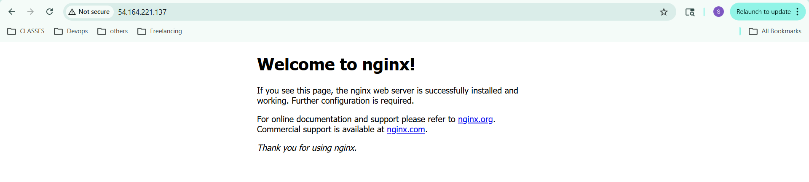

# Cloud Infrastructure Provisioning on AWS using Terraform

## Project Overview

This project demonstrates how to build and deploy a complete cloud infrastructure on AWS using Infrastructure as Code (IaC) with Terraform.

It provisions a full networking stack along with an EC2 instance running a web server (Nginx) that is accessible over the internet.

The project follows real-world DevOps practices including automation, cloud provisioning, and infrastructure management.

---

## Architecture

                 Internet
                     │
             Internet Gateway
                     │
              Route Table (0.0.0.0/0)
                     │
              Public Subnet (VPC)
                     │
        ┌──────── Security Group ────────┐
        │        (Firewall Rules)        │
        └────────────┬───────────────────┘
                     │
              EC2 Instance
             (Nginx Server)

---

## Features

- Custom VPC creation
- Public subnet configuration
- Internet gateway setup
- Route table configuration
- Security group for SSH and HTTP access
- EC2 instance provisioning
- Automated Nginx installation using user_data
- SSH key pair integration
- Outputs for public IP and DNS
- Fully automated infrastructure using Terraform

---

## Technologies Used

- Terraform
- AWS (EC2, VPC, Subnet, IGW, Route Table, Security Groups)
- Ubuntu Linux
- Nginx Web Server
- Git & GitHub

---
## Terraform Core Components Explained

This project uses key Terraform files to manage infrastructure efficiently and follow Infrastructure as Code (IaC) best practices.


### 1. variables.tf

This file defines all input variables used in the project.

Instead of hardcoding values like region, instance type, or CIDR blocks, variables are declared here to make the infrastructure reusable and flexible.


### 2. terraform.tfvars

This file provides actual values for variables defined in variables.tf.

It is used to define environment-specific configurations such as region, instance type, and CIDR blocks.

⚠️ This file is added to `.gitignore` because it may contain environment-specific configuration details and should not be pushed to version control.


### 3. outputs.tf

This file is used to display useful information after infrastructure creation.

It helps retrieve values like:
- Public IP of EC2 instance
- Public DNS name


### 4. terraform.tfstate

This file stores the current state of infrastructure managed by Terraform.

It maps real AWS resources with Terraform configuration.

 Important:
- It should NOT be pushed to GitHub
- It is automatically managed by Terraform
- It acts as the “source of truth” for infrastructure state
---

## Prerequisites Setup

### 1. Install Terraform

Download Terraform:
https://developer.hashicorp.com/terraform/downloads

Verify installation:

```bash
terraform -version
```

### 2. Install AWS CLI

Download AWS CLI:
https://docs.aws.amazon.com/cli/latest/userguide/getting-started-install.html

Verify installation:
aws --version

### 3. Configure AWS CLI

Run:
aws configure

Enter:
AWS Access Key ID: XXXXX
AWS Secret Access Key: XXXXX
Default region name: us-east-1
Default output format: json

--- 
## SSH Key Pair Setup

Before provisioning EC2, you need to generate an SSH key pair.

### 1.Generate SSH Key using ssh-keygen

Run this command in terminal or Git Bash:

ssh-keygen -t rsa -b 4096 -f ~/.ssh/terraform-key

### 2. What this does:

It creates two files:

~/.ssh/terraform-key      (Private Key - DO NOT SHARE)
~/.ssh/terraform-key.pub  (Public Key - used by AWS)

### 3. Key Usage in Terraform

The public key is uploaded to AWS using Terraform:
public_key = file("C:/Users/sunaina/.ssh/terraform-key.pub")

The private key is used for SSH access:
ssh -i ~/.ssh/terraform-key ubuntu@<public-ip>

--- 

## Project Structure
terraform-cloud/
│
├── provider.tf
├── variables.tf
├── terraform.tfvars
├── vpc.tf
├── subnet.tf
├── internet_gateway.tf
├── route_table.tf
├── security_group.tf
├── key_pair.tf
├── ec2.tf
├── outputs.tf
├── .gitignore
└── README.md

--- 

##  How to Deploy

### 1. Initialize Terraform
terraform init
### 2. Validate Configuration
terraform validate
### 3. Format Code
terraform fmt
### 4. Plan Infrastructure
terraform plan
### 5. Apply Infrastructure
terraform apply
Type: yes

-- 
## Access Web Server

After deployment, Terraform will output the public IP.
Open in browser:
http://<public-ip>

You will see the Nginx welcome page or custom Terraform page.



---

## Cleanup Resources
To destroy all resources:
terraform destroy
